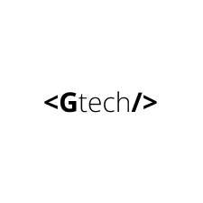

🖖🏼 &nbsp; Hi! I'm a Software Engineer 

 
 

 
  🌎 My name is Rafael Matos. I'm a <strong>Software Engineer and Designer.</strong> 

 
 
<!--  -->

 
 
### Work Experience
  

In the overview below you will find my most recent work experience:

**Software Engineer** \
[**Gtech**](https://github.com/gtech-pro) • Full-time \
Languages & Technologies: `PHP`, `Python`, `Django`, `JavaScript`, `Node`, `GoLang`, `wordpress`\
Date: `July/2021-present`	

  

**Software Engineer, Game Developer & Designer** \
[**IndieDev**](https://rafael.cf) • Part-time \
Languages & Technologies: `C#`, `Python`, `vue`, `C++`, `unity`, `react`,`wordpress`, `Blender`, `figma`, `Adobe Photoshop` \
Date: `August/2021 - present`

  

**Software Engineer** \
[**BossaBox**](https://bossabox.com/para-empresas) • Full-time \
Languages & Technologies: `next`, `react`,`node` \
Date: `March/2021 - present`

  

**Software Engineer** \
[**Rgm core**](https://rgmcore.cf) • Full-time \
Languages & Technologies: `PHP`, `Python`, `Django`, `JavaScript`, `Node`, `GoLang`, `wordpress` \
Date: `March/2020 - July/2021`

  

**Software Engineer & Designer** \
[**Freelancer**](https://www.freelancer.com) • Part-time\
Languages & Technologies: `PHP`, `Python`, `Django`, `JavaScript`, `Node`, `GoLang`, `wordpress`,`figma`, `Adobe Photoshop` \
Date: `January/2020 - present` **Check availability for freelancer**

  

**Desenvolvedor full stack** \
[**Pequi Soluções**](https://github.com/PequiSolucoes) • Full-time \
Languages & Technologies: `PHP`, `html`, `css`, `sass`, `JavaScript`,  `wordpress` \
Date: `January/2019 - January/2020`

  

**Front end developer** \
[**Top Tal**](https://www.toptal.com) • Full-time \
Languages & Technologies: `html`, `css`, `sass`, `JavaScript`, `figma`, `adobe xd`, `React`,   \
Date: `July/2018 - March/2019`

  

**Front end developer** \
[**42 Codelab**](http://www.42codelab.com) • Full-time \
Languages & Technologies: `html`, `css`, `sass`, `JavaScript`   \
Date: `July/2017 - July/2018`

  

   

